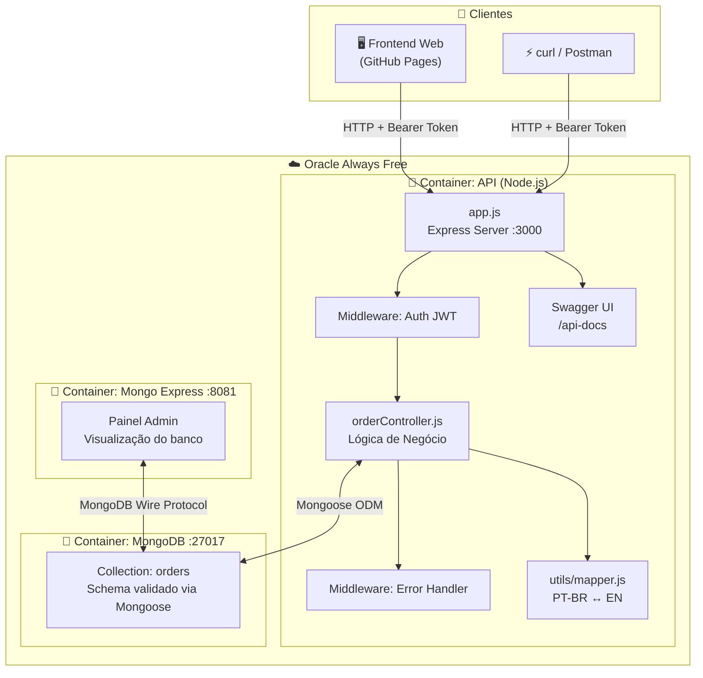
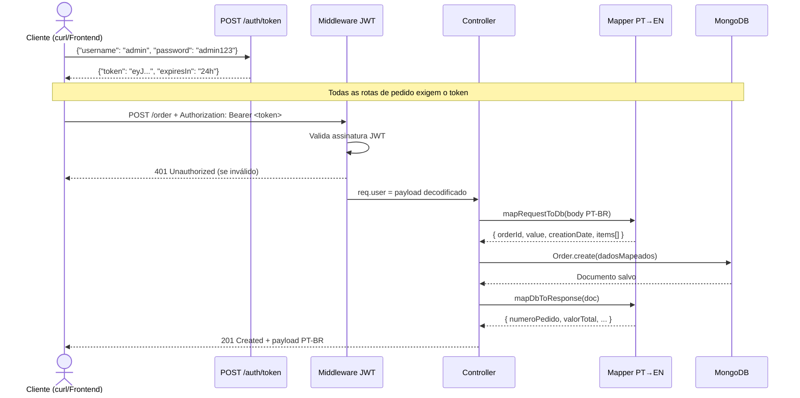
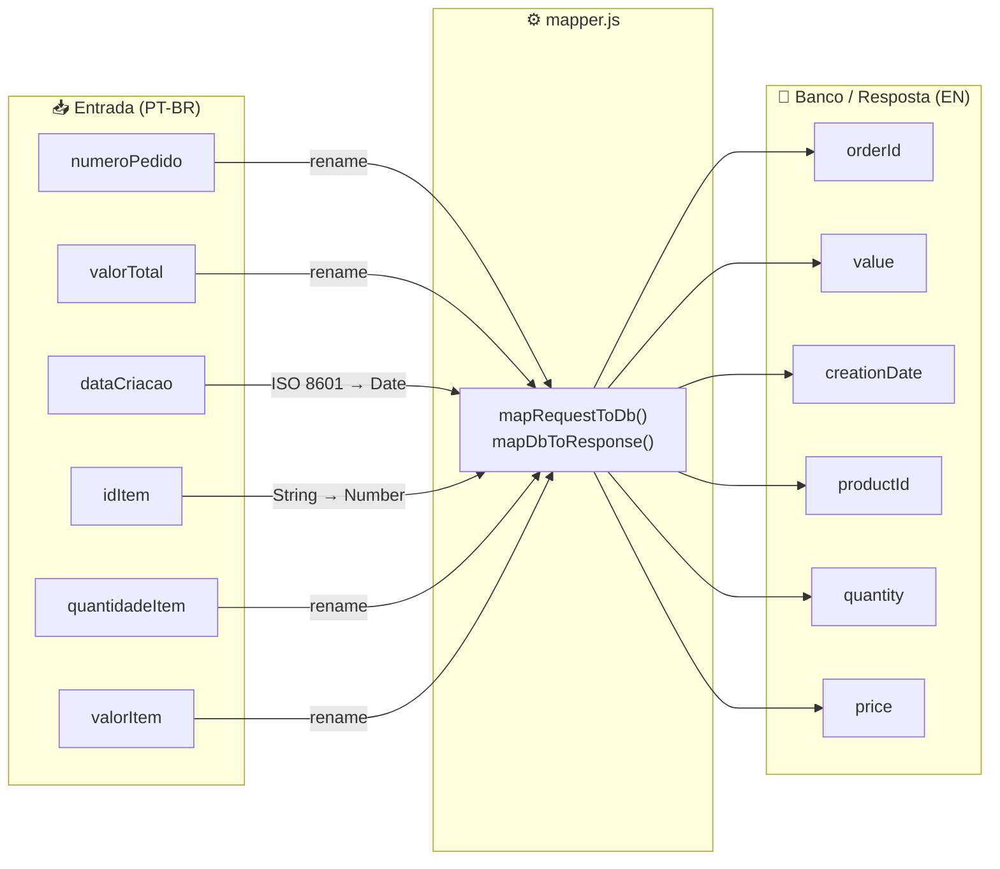
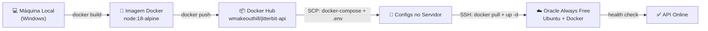

<div align="center">

# 🛒 Order Management API

## Desafio Técnico — Jitterbit

API RESTful para gerenciamento de pedidos com autenticação JWT, documentação interativa e frontend web, rodando em cloud com deploy automatizado.

[](https://nodejs.org)
[](https://expressjs.com)
[](https://mongodb.com)
[](https://docker.com)
[](https://jwt.io)
[](https://swagger.io)

---

| 🌐 Frontend (ao vivo) | 🔌 API | 📖 Swagger Docs | 🗄️ Mongo Express |
|:---:|:---:|:---:|:---:|
| [GitHub Pages](https://wmakeouthill.github.io/desafio_tecnico_jitterbit/) | [134.65.250.48:3000](http://134.65.250.48:3000) | [/api-docs](http://134.65.250.48:3000/api-docs) | [:8081](http://134.65.250.48:8081) |

</div>

---

## Visão Geral

Este projeto entrega uma solução completa para o desafio técnico proposto, indo além dos requisitos obrigatórios para incluir autenticação JWT, documentação Swagger interativa, frontend web funcional, containerização com Docker e deploy automatizado em cloud pública.

O diferencial central está no **data mapper** — a API aceita payloads em português (conforme o sistema legado), transforma os dados para o padrão em inglês internamente, e persiste tudo no MongoDB com schema validado.

---

## Arquitetura



---

## Fluxo de uma Requisição



---

## Mapeamento de Dados

Um dos requisitos centrais do desafio é a **transformação do payload** recebido para o formato interno. O `mapper.js` faz essa ponte de forma bidirecional:



| Payload de Entrada (PT-BR) | Tipo | Banco de Dados (EN) | Tipo |
|---|---|---|---|
| `numeroPedido` | `string` | `orderId` | `string` |
| `valorTotal` | `number` | `value` | `number` |
| `dataCriacao` | `string ISO 8601` | `creationDate` | `Date` |
| `items[].idItem` | `string` | `items[].productId` | `number` |
| `items[].quantidadeItem` | `number` | `items[].quantity` | `number` |
| `items[].valorItem` | `number` | `items[].price` | `number` |

---

## Pipeline de Deploy



**Executar deploy:**

```bash
./deploy.bat   # Windows — build local → push Hub → SSH → restart
```

---

## Stack e Decisões Técnicas

### Por que cada tecnologia foi escolhida

| Tecnologia | Papel | Decisão |
|---|---|---|
| **Node.js 18 + Express 4** | Servidor HTTP | Requisito do desafio. Express pela maturidade, ecossistema e velocidade de desenvolvimento |
| **MongoDB + Mongoose** | Banco de dados | Schema flexível ideal para itens variáveis por pedido. Mongoose adiciona validação, tipagem e índices declarativos |
| **JWT + bcryptjs** | Autenticação | Stateless — o servidor não precisa de sessão. bcrypt com 10 rounds para hash seguro da senha |
| **Swagger (swagger-jsdoc + swagger-ui-express)** | Documentação | Gerada diretamente dos comentários JSDoc nas rotas, sempre sincronizada com o código |
| **Docker + Docker Compose** | Containerização | Garante ambiente idêntico entre dev e produção. Compose orquestra API + MongoDB + Mongo Express |
| **Oracle Always Free** | Hospedagem | Instância ARM gratuita e permanente — sem custo, sem expiração |
| **GitHub Pages** | Frontend | Deploy automático via git push — sem custo, CDN global |

### Decisões de arquitetura notáveis

**Separação de responsabilidades** — cada camada tem uma função única:

- `routes/` — apenas roteamento e documentação Swagger
- `controllers/` — lógica de negócio e orquestração
- `middlewares/` — cross-cutting concerns (auth, erros)
- `utils/mapper.js` — transformação de dados isolada e testável

**Error handling centralizado** — um único middleware captura todos os erros da aplicação, classificando por tipo (`ValidationError` → 400, duplicate key → 409, `CastError` → 400, genérico → 500), evitando try/catch espalhado nos controllers.

**Memory limits em produção** — a instância Oracle tem 1GB RAM compartilhada. Os containers têm limites explícitos: API 150MB, MongoDB 450MB (WiredTiger cache = 0.25GB), Mongo Express 80MB.

---

## Endpoints da API

**Base URL:** `http://localhost:3000`
**Autenticação:** `Authorization: Bearer <token>` em todas as rotas `/order/*`

### Autenticação

```bash
# Obter token JWT (válido por 24h)
curl -X POST http://localhost:3000/auth/token \
  -H "Content-Type: application/json" \
  -d '{"username": "admin", "password": "admin123"}'
```

### CRUD de Pedidos

| Método | Rota | Auth | Descrição | HTTP Sucesso |
|:---:|---|:---:|---|:---:|
| `POST` | `/order` | ✓ | Cria um novo pedido | `201 Created` |
| `GET` | `/order/list` | ✓ | Lista todos os pedidos | `200 OK` |
| `GET` | `/order/:orderId` | ✓ | Busca pedido por ID | `200 OK` |
| `PUT` | `/order/:orderId` | ✓ | Atualiza pedido | `200 OK` |
| `DELETE` | `/order/:orderId` | ✓ | Remove pedido | `200 OK` |
| `GET` | `/health` | — | Health check | `200 OK` |
| `GET` | `/api-docs` | — | Swagger UI | — |

### Exemplo completo — Criar pedido

```bash
# 1. Autenticar
TOKEN=$(curl -s -X POST http://localhost:3000/auth/token \
  -H "Content-Type: application/json" \
  -d '{"username":"admin","password":"admin123"}' | jq -r .token)

# 2. Criar pedido (payload em PT-BR conforme especificação)
curl -X POST http://localhost:3000/order \
  -H "Content-Type: application/json" \
  -H "Authorization: Bearer $TOKEN" \
  -d '{
    "numeroPedido": "v10089015vdb-01",
    "valorTotal": 10000,
    "dataCriacao": "2023-07-19T12:24:11.5299601+00:00",
    "items": [
      { "idItem": "2434", "quantidadeItem": 1, "valorItem": 1000 }
    ]
  }'
```

**Resposta `201 Created`:**

```json
{
  "message": "Pedido criado com sucesso",
  "order": {
    "orderId": "v10089015vdb-01",
    "value": 10000,
    "creationDate": "2023-07-19T12:24:11.529Z",
    "items": [
      { "productId": 2434, "quantity": 1, "price": 1000 }
    ]
  }
}
```

---

## Schema do MongoDB

```js
// Collection: orders
{
  orderId:      String,   // único, obrigatório
  value:        Number,   // ≥ 0, obrigatório
  creationDate: Date,     // obrigatório
  items: [{
    productId:  Number,   // obrigatório
    quantity:   Number,   // ≥ 1, obrigatório
    price:      Number    // ≥ 0, obrigatório
  }]                      // mínimo 1 item por pedido
}
```

---

## Rodando Localmente

**Pré-requisito:** Docker instalado.

```bash
# 1. Clone o repositório
git clone https://github.com/wmakeouthill/desafio_tecnico_jitterbit.git
cd desafio_tecnico_jitterbit

# 2. Configure o ambiente
cp .env.example .env

# 3. Suba os containers
docker compose up -d --build
```

| Serviço | URL |
|---|---|
| API + Frontend | <http://localhost:3000> |
| Swagger Docs | <http://localhost:3000/api-docs> |
| Mongo Express | <http://localhost:8081> |

```bash
# Parar
docker compose down

# Parar e remover dados persistidos
docker compose down -v
```

### Variáveis de ambiente

```env
PORT=3000
MONGODB_URI=mongodb://mongodb:27017/orders_db
JWT_SECRET=sua_chave_secreta_forte_aqui
NODE_ENV=production
```

> `.env` nunca é versionado — apenas `.env.example` fica no repositório.

---

## Estrutura do Projeto

```text
├── src/
│   ├── app.js                   # Entry point — Express, middlewares, rotas
│   ├── config/
│   │   └── database.js          # Conexão MongoDB via Mongoose
│   ├── controllers/
│   │   └── orderController.js   # CRUD + lógica de negócio
│   ├── middlewares/
│   │   ├── auth.js              # Validação JWT
│   │   └── errorHandler.js      # Tratamento centralizado de erros
│   ├── models/
│   │   └── Order.js             # Schema Mongoose com validações
│   ├── routes/
│   │   ├── orderRoutes.js       # Rotas + JSDoc Swagger
│   │   └── authRoutes.js        # Rota de autenticação
│   ├── swagger/
│   │   └── swaggerConfig.js     # Configuração OpenAPI 3.0
│   └── utils/
│       └── mapper.js            # Transformação PT-BR ↔ EN
│
├── public/                      # Frontend estático (Vanilla JS)
│   ├── index.html
│   ├── css/styles.css
│   └── js/
│       ├── api.js               # Cliente HTTP
│       ├── auth.js              # Login/logout
│       ├── orders.js            # CRUD via UI
│       └── utils.js             # Helpers de formatação
│
├── scripts/
│   ├── deploy.sh                # Script remoto de restart
│   └── server-setup.sh          # Inicialização do servidor
│
├── .env.example
├── Dockerfile
├── docker-compose.yml           # Desenvolvimento local
├── docker-compose.prod.yml      # Produção (Oracle, com memory limits)
└── deploy.bat                   # Pipeline de deploy (Windows)
```

---

## Requisitos Atendidos

| Requisito | Status |
|---|:---:|
| `POST /order` — Criar pedido | ✅ |
| `GET /order/:id` — Buscar por ID | ✅ |
| `GET /order/list` — Listar todos | ✅ |
| `PUT /order/:id` — Atualizar pedido | ✅ |
| `DELETE /order/:id` — Deletar pedido | ✅ |
| Banco de dados (MongoDB) | ✅ |
| Mapeamento PT-BR → EN dos dados | ✅ |
| Tratamento de erros e HTTP status codes corretos | ✅ |
| Código organizado por camadas | ✅ |
| **[Extra]** Autenticação JWT + bcrypt | ✅ |
| **[Extra]** Documentação Swagger/OpenAPI 3.0 | ✅ |
| **[Extra]** Frontend web funcional | ✅ |
| **[Extra]** Containerização com Docker Compose | ✅ |
| **[Extra]** Deploy em cloud pública (Oracle Always Free) | ✅ |
| **[Extra]** Pipeline de deploy automatizado | ✅ |

---

<div align="center">
  <sub>Desenvolvido por <a href="https://github.com/wmakeouthill">wmakeouthill</a> para o Desafio Técnico Jitterbit</sub>
</div>
